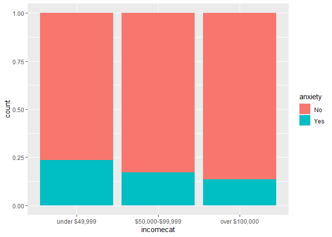
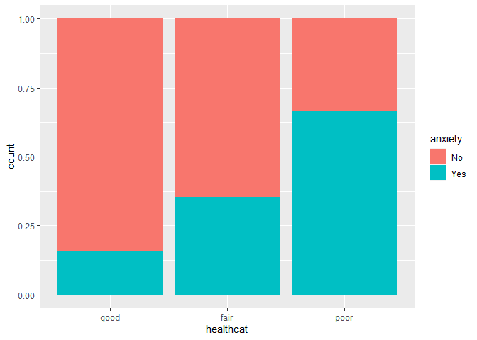

BST 210 Project
================
2022-12-05

# Data Cleaning

``` r
data <-
  data %>%
  dplyr::select(AGE, SEX, RACENEW, INCFAM07ON, HEALTH, MOD10DMIN, ANXIETYEV, DEPFREQ, EMOSUPPORT, CVDSYMP, REGION) %>% 
  filter(MOD10DMIN != 000) %>% 
  filter(ANXIETYEV != 0) %>% 
  filter(DEPFREQ != 0) %>% 
  filter(EMOSUPPORT != 0) %>% 
  filter(CVDSYMP != 0)
```

``` r
data$AGE[data$AGE == 997] = NA
data$AGE[data$AGE == 999] = NA
```

``` r
data$sexcat <- NA
data$sexcat[data$SEX == 1] = "male"
data$sexcat[data$SEX == 2] = "female"
data$sexcat <- as.factor(data$sexcat)
```

``` r
data$racecat <- NA
data$racecat[data$RACENEW == 100] = "white"
data$racecat[data$RACENEW == 200] = "non-white"
data$racecat[data$RACENEW == 300] = "non-white"
data$racecat[data$RACENEW == 400] = "non-white"
data$racecat[data$RACENEW > 400 & data$RACENEW < 900] = "non-white"
data$racecat <- as.factor(data$racecat)
```

``` r
data$incomecat <- NA
data$incomecat[data$INCFAM07ON == 11] = "under $49,999"
data$incomecat[data$INCFAM07ON == 12] = "under $49,999"
data$incomecat[data$INCFAM07ON == 22] = "$50,000-$99,999"
data$incomecat[data$INCFAM07ON == 23] = "$50,000-$99,999"
data$incomecat[data$INCFAM07ON == 24] = "over $100,000"
data$incomecat <- factor(data$incomecat, levels = c("under $49,999", "$50,000-$99,999", "over $100,000"))
```

``` r
data$healthcat <- NA
data$healthcat[data$HEALTH == 1] = "good"
data$healthcat[data$HEALTH == 2] = "good"
data$healthcat[data$HEALTH == 3] = "good"
data$healthcat[data$HEALTH == 4] = "fair"
data$healthcat[data$HEALTH == 5] = "poor"
data$healthcat <- factor(data$healthcat, levels = c("good", "fair", "poor"))
```

``` r
data$MOD10DMIN[data$MOD10DMIN %in% c(996, 997, 998, 999)] = NA
```

``` r
data$anxiety <- NA
data$anxiety[data$ANXIETYEV == 1] = "No"
data$anxiety[data$ANXIETYEV == 2] = "Yes"
data$anxiety <- factor(data$anxiety, levels = c("No", "Yes"))
```

``` r
data$depress <- NA
data$depress[data$DEPFREQ == 1] = "daily"
data$depress[data$DEPFREQ == 2] = "weekly or monthly"
data$depress[data$DEPFREQ == 3] = "weekly or monthly"
data$depress[data$DEPFREQ == 4] = "yearly"
data$depress[data$DEPFREQ == 5] = "never"
data$depress <- factor(data$depress, levels = c("never", "daily", "weekly or monthly", "yearly"))
```

``` r
data$esupport <- NA
data$esupport[data$EMOSUPPORT == 1] = "always"
data$esupport[data$EMOSUPPORT == 2] = "usually"
data$esupport[data$EMOSUPPORT == 3] = "sometimes-never"
data$esupport[data$EMOSUPPORT == 4] = "sometimes-never"
data$esupport[data$EMOSUPPORT == 5] = "sometimes-never"
data$esupport <- factor(data$esupport, levels = c("always", "usually", "sometimes-never"))
```

``` r
data$sympt <- NA
data$sympt[data$CVDSYMP == 1] = "no symptoms"
data$sympt[data$CVDSYMP == 2] = "mild symptoms"
data$sympt[data$CVDSYMP == 3] = "moderate symptoms"
data$sympt[data$CVDSYMP == 4] = "severe symptoms"
data$sympt <- factor(data$sympt, levels = c("no symptoms", "mild symptoms", "moderate symptoms", "severe symptoms"))
```

``` r
data$reg <- NA
data$reg[data$REGION == 1] = "northeast"
data$reg[data$REGION == 2] = "midwest"
data$reg[data$REGION == 3] = "south"
data$reg[data$REGION == 4] = "west"
data$reg <- factor(data$reg, levels = c("northeast", "midwest", "south", "west"))
```

``` r
data <- data %>% 
  dplyr::select(12:20, AGE, MOD10DMIN)

data %>% 
  summary()
```

    ##     sexcat         racecat              incomecat   healthcat  anxiety  
    ##  female:241   non-white: 74   under $49,999  :140   good:403   No :368  
    ##  male  :205   white    :334   $50,000-$99,999:126   fair: 39   Yes: 78  
    ##               NA's     : 38   over $100,000  :180   poor:  4            
    ##                                                                         
    ##                                                                         
    ##                                                                         
    ##                                                                         
    ##               depress               esupport                 sympt    
    ##  never            :239   always         :239   no symptoms      : 60  
    ##  daily            : 16   usually        :115   mild symptoms    :144  
    ##  weekly or monthly: 65   sometimes-never: 82   moderate symptoms:162  
    ##  yearly           :125   NA's           : 10   severe symptoms  : 79  
    ##  NA's             :  1                         NA's             :  1  
    ##                                                                       
    ##                                                                       
    ##         reg           AGE          MOD10DMIN     
    ##  northeast: 70   Min.   :18.00   Min.   :  1.00  
    ##  midwest  :109   1st Qu.:31.00   1st Qu.: 30.00  
    ##  south    :172   Median :44.00   Median : 45.00  
    ##  west     : 95   Mean   :45.12   Mean   : 58.75  
    ##                  3rd Qu.:58.00   3rd Qu.: 60.00  
    ##                  Max.   :85.00   Max.   :480.00  
    ##                  NA's   :1       NA's   :3

``` r
# dim(data)[1]*0.05 # 5% missing 22.3

data <- data %>% drop_na()

# dim(data) # 397*11
```

# Data Visualization

``` r
data %>% 
  ggplot(aes(x=sexcat, fill=anxiety)) +
  geom_bar(position="fill")
```

<!-- -->

``` r
data %>% 
  ggplot(aes(x=sexcat, fill=depress)) +
  geom_bar(position="fill")
```

<!-- -->

> Female seems to be positively associated with anxiety and depression.

``` r
data %>% 
  ggplot(aes(x=racecat, fill=anxiety)) +
  geom_bar(position="fill")
```

<!-- -->

``` r
data %>% 
  ggplot(aes(x=racecat, fill=depress)) +
  geom_bar(position="fill")
```

<!-- -->

> White and other seem to be at higher risk of anxiety and depression.

``` r
data %>% 
  ggplot(aes(x=incomecat, fill=anxiety)) +
  geom_bar(position="fill")
```

<!-- -->

``` r
data %>% 
  ggplot(aes(x=incomecat, fill=depress)) +
  geom_bar(position="fill")
```

<!-- -->

> Higher income seems to be a protective factor.

``` r
data %>% 
  ggplot(aes(x=healthcat, fill=anxiety)) +
  geom_bar(position="fill")
```

<!-- -->

``` r
data %>% 
  ggplot(aes(x=healthcat, fill=depress)) +
  geom_bar(position="fill")
```

<!-- -->

> Poor health status is highly associated with anxiety and especially
> depression.

``` r
data %>% 
  ggplot(aes(x=esupport, fill=anxiety)) +
  geom_bar(position="fill")
```

<!-- -->

``` r
data %>% 
  ggplot(aes(x=esupport, fill=depress)) +
  geom_bar(position="fill")
```

<!-- -->

> Participants who rarely or sometimes receive emotional support seem to
> be under higher risk of anxiety and depression.

``` r
data %>% 
  ggplot(aes(x=sympt, fill=anxiety)) +
  geom_bar(position="fill")
```

<!-- -->

``` r
data %>% 
  ggplot(aes(x=sympt, fill=depress)) +
  geom_bar(position="fill")
```

<!-- -->

> Severity of covid symptoms seems to be positively associated with
> anxiety and depression.

``` r
data %>% 
  ggplot(aes(x=anxiety,y=AGE)) +
  geom_boxplot()
```

<!-- -->

``` r
data %>% 
  ggplot(aes(x=depress,y=AGE)) +
  geom_boxplot()
```

<!-- -->

> Participants with anxiety are on average younger, while participants
> who feel depressed daily are older between 40 and 60.

``` r
data %>% 
  ggplot(aes(x=anxiety,y=MOD10DMIN)) +
  geom_boxplot()
```

<!-- -->

``` r
data %>% 
  ggplot(aes(x=depress,y=MOD10DMIN)) +
  geom_boxplot()
```

<!-- -->

> Exercise seems to be a protective factor.

``` r
data %>% 
  ggplot(aes(x = AGE)) +
  geom_density()
```

<!-- -->

``` r
data %>% 
  ggplot(aes(x = MOD10DMIN)) +
  geom_density()
```

<!-- -->

# Modeling

## Anxiety - logistic

``` r
data_logis <- data %>% dplyr::select(-depress)


logis1 <- glm(anxiety ~ AGE + sexcat + racecat + MOD10DMIN + healthcat + sympt + reg + esupport + incomecat,
              family = binomial, data = data_logis)
logis2 <- glm(anxiety ~ AGE + sexcat + racecat + MOD10DMIN + healthcat + sympt + esupport,
              family = binomial, data = data_logis)
logis3 <- glm(anxiety ~ AGE + sexcat + racecat + healthcat + sympt + esupport,
              family = binomial, data = data_logis)
logis4 <- glm(anxiety ~ AGE + sexcat + racecat + MOD10DMIN + healthcat + sympt,
              family = binomial, data = data_logis)
logis5 <- glm(anxiety ~ AGE + MOD10DMIN + healthcat + sympt + esupport,
              family = binomial, data = data_logis)
logis6 <- glm(anxiety ~ AGE + sexcat + racecat + healthcat + sympt,
              family = binomial, data = data_logis)
logis7 <- glm(anxiety ~ AGE + healthcat + sympt,
              family = binomial, data = data_logis)
```

``` r
logis1$coefficients[8:10]
```

    ##     symptmild symptoms symptmoderate symptoms   symptsevere symptoms 
    ##           -0.247697969           -0.005964833            0.187867083

``` r
logis2$coefficients[8:10]
```

    ##     symptmild symptoms symptmoderate symptoms   symptsevere symptoms 
    ##            -0.29003136            -0.09441099             0.16756527

``` r
logis3$coefficients[7:9]
```

    ##     symptmild symptoms symptmoderate symptoms   symptsevere symptoms 
    ##            -0.28897865            -0.09247586             0.16997915

``` r
logis4$coefficients[8:10]
```

    ##     symptmild symptoms symptmoderate symptoms   symptsevere symptoms 
    ##            -0.25547872            -0.07354255             0.16603042

``` r
logis5$coefficients[6:8]
```

    ##     symptmild symptoms symptmoderate symptoms   symptsevere symptoms 
    ##             -0.1809428              0.0738149              0.2229652

``` r
logis6$coefficients[7:9]
```

    ##     symptmild symptoms symptmoderate symptoms   symptsevere symptoms 
    ##            -0.25501804            -0.07268736             0.16699790

``` r
logis7$coefficients[5:7]
```

    ##     symptmild symptoms symptmoderate symptoms   symptsevere symptoms 
    ##             -0.1505163              0.1055298              0.2298666

``` r
anova(logis2,logis1,test="Chisq")$`Pr(>Chi)` # p>0.05
```

    ## [1]        NA 0.5350914

``` r
anova(logis3,logis2,test="Chisq")$`Pr(>Chi)` # p>0.05
```

    ## [1]        NA 0.9396426

``` r
anova(logis4,logis2,test="Chisq")$`Pr(>Chi)` # p>0.05
```

    ## [1]        NA 0.1151778

``` r
anova(logis5,logis2,test="Chisq")$`Pr(>Chi)` # p<<0.05
```

    ## [1]         NA 0.01761369

``` r
anova(logis6,logis3,test="Chisq")$`Pr(>Chi)` # p>0.05
```

    ## [1]        NA 0.1154385

``` r
anova(logis6,logis4,test="Chisq")$`Pr(>Chi)` # p>0.05
```

    ## [1]        NA 0.9722419

``` r
anova(logis7,logis6,test="Chisq")$`Pr(>Chi)` # p<<0.05
```

    ## [1]         NA 0.01862658

``` r
# logis6 based on LRT
```

``` r
# no significant interaction

logis3_e <- glm(anxiety ~ AGE + sexcat + racecat + healthcat + sympt:esupport,
              family = binomial, data = data_logis)
logis6_h <- glm(anxiety ~ AGE + sexcat + racecat + healthcat:sympt,
              family = binomial, data = data_logis)

anova(logis6,logis6_h,test="Chisq")$`Pr(>Chi)` # p>0.05
```

    ## [1]        NA 0.2869032

``` r
anova(logis3,logis3_e,test="Chisq")$`Pr(>Chi)` # p>0.05
```

    ## [1]        NA 0.2411439

``` r
# options(scipen = 999)
tlogis1 = tidy(logis1)
tlogis2 = tidy(logis2)
tlogis3 = tidy(logis3)
tlogis4 = tidy(logis4)
tlogis5 = tidy(logis5)
tlogis6 = tidy(logis6)
tlogis7 = tidy(logis7)

tlogis1$term[tlogis1$p.value < 0.05]
```

    ## [1] "(Intercept)"   "racecatwhite"  "healthcatfair"

``` r
tlogis2$term[tlogis2$p.value < 0.05]
```

    ## [1] "(Intercept)"             "sexcatmale"             
    ## [3] "healthcatfair"           "esupportsometimes-never"

``` r
tlogis3$term[tlogis3$p.value < 0.05]
```

    ## [1] "(Intercept)"             "sexcatmale"             
    ## [3] "healthcatfair"           "esupportsometimes-never"

``` r
tlogis4$term[tlogis4$p.value < 0.05]
```

    ## [1] "(Intercept)"   "healthcatfair"

``` r
tlogis5$term[tlogis5$p.value < 0.05]
```

    ## [1] "(Intercept)"             "healthcatfair"          
    ## [3] "esupportsometimes-never"

``` r
tlogis6$term[tlogis6$p.value < 0.05]
```

    ## [1] "(Intercept)"   "healthcatfair"

``` r
tlogis7$term[tlogis7$p.value < 0.05]
```

    ## [1] "(Intercept)"   "healthcatfair"

``` r
# logis2, logis3 based on number of significant covariates
```

``` r
# hist(logis$fitted, main="p-hats")
# hist(hatvalues(logis), main="hat-values")

# H0: fit of the model is adequate
options(digits=7)
hoslem.test(logis1$y,fitted(logis1),g=10)
```

    ## 
    ##  Hosmer and Lemeshow goodness of fit (GOF) test
    ## 
    ## data:  logis1$y, fitted(logis1)
    ## X-squared = 4.6925, df = 8, p-value = 0.7899

``` r
hoslem.test(logis2$y,fitted(logis2),g=10)
```

    ## 
    ##  Hosmer and Lemeshow goodness of fit (GOF) test
    ## 
    ## data:  logis2$y, fitted(logis2)
    ## X-squared = 13.236, df = 8, p-value = 0.104

``` r
hoslem.test(logis3$y,fitted(logis3),g=10)
```

    ## 
    ##  Hosmer and Lemeshow goodness of fit (GOF) test
    ## 
    ## data:  logis3$y, fitted(logis3)
    ## X-squared = 9.9871, df = 8, p-value = 0.2659

``` r
hoslem.test(logis4$y,fitted(logis4),g=10)
```

    ## 
    ##  Hosmer and Lemeshow goodness of fit (GOF) test
    ## 
    ## data:  logis4$y, fitted(logis4)
    ## X-squared = 16.188, df = 8, p-value = 0.03977

``` r
hoslem.test(logis5$y,fitted(logis5),g=10)
```

    ## 
    ##  Hosmer and Lemeshow goodness of fit (GOF) test
    ## 
    ## data:  logis5$y, fitted(logis5)
    ## X-squared = 5.6385, df = 8, p-value = 0.6876

``` r
hoslem.test(logis6$y,fitted(logis6),g=10)
```

    ## 
    ##  Hosmer and Lemeshow goodness of fit (GOF) test
    ## 
    ## data:  logis6$y, fitted(logis6)
    ## X-squared = 13.009, df = 8, p-value = 0.1115

``` r
hoslem.test(logis7$y,fitted(logis7),g=10)
```

    ## 
    ##  Hosmer and Lemeshow goodness of fit (GOF) test
    ## 
    ## data:  logis7$y, fitted(logis7)
    ## X-squared = 8.6109, df = 8, p-value = 0.3762

``` r
# logis1, logis5, logis7, logis3, logis6, logis2 based on H-L GOF
```

``` r
predprob1 <- predict(logis1,type=c("response"))
roccurve1 <- roc(data_logis$anxiety ~ predprob1)
predprob2 <- predict(logis2,type=c("response"))
roccurve2 <- roc(data_logis$anxiety ~ predprob2)
predprob3 <- predict(logis3,type=c("response"))
roccurve3 <- roc(data_logis$anxiety ~ predprob3)
predprob4 <- predict(logis4,type=c("response"))
roccurve4 <- roc(data_logis$anxiety ~ predprob4)
predprob5 <- predict(logis5,type=c("response"))
roccurve5 <- roc(data_logis$anxiety ~ predprob5)
predprob6 <- predict(logis6,type=c("response"))
roccurve6 <- roc(data_logis$anxiety ~ predprob6)
predprob7 <- predict(logis7,type=c("response"))
roccurve7 <- roc(data_logis$anxiety ~ predprob7)
```

``` r
data.frame(MODEL=c("logis1","logis2","logis3","logis4","logis5","logis6","logis7"),
           AIC=c(AIC(logis1),AIC(logis2),AIC(logis3),AIC(logis4),AIC(logis5),AIC(logis6),AIC(logis7)),
           BIC=c(BIC(logis1),BIC(logis2),BIC(logis3),BIC(logis4),BIC(logis5),BIC(logis6),BIC(logis7)),
           AUC=c(auc(roccurve1),auc(roccurve2),auc(roccurve3),auc(roccurve4),auc(roccurve5),auc(roccurve6),auc(roccurve7)))
```

    ##    MODEL      AIC      BIC       AUC
    ## 1 logis1 375.5568 443.2837 0.6869157
    ## 2 logis2 369.6569 417.4641 0.6741372
    ## 3 logis3 367.6626 411.4859 0.6742901
    ## 4 logis4 369.9795 409.8188 0.6674967
    ## 5 logis5 373.7351 413.5744 0.6338139
    ## 6 logis6 367.9807 403.8361 0.6683705
    ## 7 logis7 371.9470 399.8346 0.6055920

``` r
# logis3, logis6 based on AIC
# logis7, logis6 based on BIC
# logis1, logis3, logis2, logis6 based on AUC

# stepModel <- step(logis1, direction=c("both"))
# sexcat + racecat + healthcat + esupport based on stepwise selection

pred<-ifelse(predict(logis3,type="response")>0.5,"Yes","No")
actu<-data_logis$anxiety
confusionMatrix(table(pred,actu))
```

    ## Confusion Matrix and Statistics
    ## 
    ##      actu
    ## pred   No Yes
    ##   No  324  67
    ##   Yes   3   3
    ##                                           
    ##                Accuracy : 0.8237          
    ##                  95% CI : (0.7826, 0.8599)
    ##     No Information Rate : 0.8237          
    ##     P-Value [Acc > NIR] : 0.5319          
    ##                                           
    ##                   Kappa : 0.0526          
    ##                                           
    ##  Mcnemar's Test P-Value : 5.076e-14       
    ##                                           
    ##             Sensitivity : 0.99083         
    ##             Specificity : 0.04286         
    ##          Pos Pred Value : 0.82864         
    ##          Neg Pred Value : 0.50000         
    ##              Prevalence : 0.82368         
    ##          Detection Rate : 0.81612         
    ##    Detection Prevalence : 0.98489         
    ##       Balanced Accuracy : 0.51684         
    ##                                           
    ##        'Positive' Class : No              
    ## 

``` r
pred<-ifelse(predict(logis6,type="response")>0.5,"Yes","No")
actu<-data_logis$anxiety
confusionMatrix(table(pred,actu))
```

    ## Confusion Matrix and Statistics
    ## 
    ##      actu
    ## pred   No Yes
    ##   No  325  67
    ##   Yes   2   3
    ##                                           
    ##                Accuracy : 0.8262          
    ##                  95% CI : (0.7853, 0.8622)
    ##     No Information Rate : 0.8237          
    ##     P-Value [Acc > NIR] : 0.4794          
    ##                                           
    ##                   Kappa : 0.0579          
    ##                                           
    ##  Mcnemar's Test P-Value : 1.312e-14       
    ##                                           
    ##             Sensitivity : 0.99388         
    ##             Specificity : 0.04286         
    ##          Pos Pred Value : 0.82908         
    ##          Neg Pred Value : 0.60000         
    ##              Prevalence : 0.82368         
    ##          Detection Rate : 0.81864         
    ##    Detection Prevalence : 0.98741         
    ##       Balanced Accuracy : 0.51837         
    ##                                           
    ##        'Positive' Class : No              
    ## 

``` r
VIF(logis1) # no collinearity
```

    ##               GVIF Df GVIF^(1/(2*Df))
    ## AGE       1.086843  1        1.042518
    ## sexcat    1.026409  1        1.013119
    ## racecat   1.080902  1        1.039664
    ## MOD10DMIN 1.058572  1        1.028869
    ## healthcat 1.101702  2        1.024510
    ## sympt     1.176108  3        1.027404
    ## reg       1.141802  3        1.022347
    ## esupport  1.101648  2        1.024497
    ## incomecat 1.148030  2        1.035114

``` r
VIF(logis3) # no collinearity
```

    ##               GVIF Df GVIF^(1/(2*Df))
    ## AGE       1.063723  1        1.031370
    ## sexcat    1.018727  1        1.009320
    ## racecat   1.052703  1        1.026013
    ## healthcat 1.052728  2        1.012929
    ## sympt     1.121260  3        1.019259
    ## esupport  1.038605  2        1.009514

``` r
VIF(logis6) # no collinearity
```

    ##               GVIF Df GVIF^(1/(2*Df))
    ## AGE       1.064500  1        1.031746
    ## sexcat    1.017052  1        1.008490
    ## racecat   1.053983  1        1.026637
    ## healthcat 1.041530  2        1.010225
    ## sympt     1.102608  3        1.016413

## Depression - multinomial & ordinal

``` r
data_multi <- data %>% dplyr::select(-anxiety)

multi1 <- multinom(depress ~ AGE + sexcat + racecat + MOD10DMIN + healthcat + sympt + reg + esupport + incomecat, data = data_multi)
multi2 <- multinom(depress ~ AGE + sexcat + racecat + MOD10DMIN + healthcat + sympt + esupport, data = data_multi)
multi3 <- multinom(depress ~ AGE + sexcat + racecat + healthcat + sympt + esupport, data = data_multi)
multi4 <- multinom(depress ~ AGE + sexcat + racecat + MOD10DMIN + healthcat + sympt, data = data_multi)
multi5 <- multinom(depress ~ AGE + MOD10DMIN + healthcat + sympt + esupport, data = data_multi)
multi6 <- multinom(depress ~ AGE + sexcat + racecat + healthcat + sympt, data = data_multi)
multi7 <- multinom(depress ~ AGE + healthcat + sympt, data = data_multi)
```

``` r
coef(multi1)[,8:10]
```

    ##                   symptmild symptoms symptmoderate symptoms
    ## daily                     -2.0535995             -0.5519945
    ## weekly or monthly         -0.3050451              0.3222653
    ## yearly                     0.3562810              1.0385223
    ##                   symptsevere symptoms
    ## daily                        1.1558441
    ## weekly or monthly            0.4233404
    ## yearly                       1.0054904

``` r
coef(multi2)[,8:10]
```

    ##                   symptmild symptoms symptmoderate symptoms
    ## daily                     -2.2524725             -0.6565946
    ## weekly or monthly         -0.3457732              0.3054771
    ## yearly                     0.2719140              1.0075965
    ##                   symptsevere symptoms
    ## daily                        0.9393633
    ## weekly or monthly            0.4667145
    ## yearly                       1.0528752

``` r
coef(multi3)[,7:9]
```

    ##                   symptmild symptoms symptmoderate symptoms
    ## daily                     -2.2510663             -0.6787723
    ## weekly or monthly         -0.3251514              0.3382121
    ## yearly                     0.2658774              1.0031350
    ##                   symptsevere symptoms
    ## daily                        0.9339796
    ## weekly or monthly            0.5064456
    ## yearly                       1.0427955

``` r
coef(multi4)[,8:10]
```

    ##                   symptmild symptoms symptmoderate symptoms
    ## daily                     -1.8718049             -0.3192431
    ## weekly or monthly         -0.2491003              0.4317267
    ## yearly                     0.2993094              1.0585815
    ##                   symptsevere symptoms
    ## daily                        1.0688915
    ## weekly or monthly            0.4289015
    ## yearly                       1.0290449

``` r
coef(multi5)[,6:8]
```

    ##                   symptmild symptoms symptmoderate symptoms
    ## daily                     -2.0273424             -0.3756657
    ## weekly or monthly         -0.2905221              0.3822645
    ## yearly                     0.2793311              1.0294561
    ##                   symptsevere symptoms
    ## daily                        1.0955201
    ## weekly or monthly            0.4878121
    ## yearly                       1.0493774

``` r
coef(multi6)[,7:9]
```

    ##                   symptmild symptoms symptmoderate symptoms
    ## daily                     -1.8742328             -0.3322938
    ## weekly or monthly         -0.2367581              0.4512837
    ## yearly                     0.2900526              1.0503638
    ##                   symptsevere symptoms
    ## daily                         1.064912
    ## weekly or monthly             0.454630
    ## yearly                        1.011867

``` r
coef(multi7)[,5:7]
```

    ##                   symptmild symptoms symptmoderate symptoms
    ## daily                     -1.7706372             -0.1299562
    ## weekly or monthly         -0.1805483              0.5371027
    ## yearly                     0.2993619              1.0757372
    ##                   symptsevere symptoms
    ## daily                        1.1243872
    ## weekly or monthly            0.4804613
    ## yearly                       1.0113661

``` r
anova(multi2,multi1,test="Chisq")$`Pr(Chi)` # p>0.05
```

    ## [1]        NA 0.2376931

``` r
anova(multi3,multi2,test="Chisq")$`Pr(Chi)` # p>0.05
```

    ## [1]        NA 0.4835993

``` r
anova(multi4,multi2,test="Chisq")$`Pr(Chi)` # p<<0.05
```

    ## [1]           NA 3.682396e-06

``` r
anova(multi5,multi3,test="Chisq")$`Pr(Chi)` # p>0.05
```

    ## [1]        NA 0.6642791

``` r
anova(multi6,multi5,test="Chisq")$`Pr(Chi)` # p<<0.05
```

    ## [1]           NA 3.008774e-07

``` r
anova(multi7,multi5,test="Chisq")$`Pr(Chi)` # p<<0.05
```

    ## [1]           NA 2.551386e-05

``` r
# multi5 based on LRT
```

``` r
# no significant interaction

multi3_e <- multinom(depress ~ AGE + sexcat + racecat + healthcat + sympt:esupport, data = data_multi)
multi5_h <- multinom(depress ~ AGE + MOD10DMIN + healthcat:sympt + esupport, data = data_multi)

anova(multi5,multi5_h,test="Chisq")$`Pr(Chi)` # p>0.05
anova(multi3,multi3_e,test="Chisq")$`Pr(Chi)` # p>0.05
```

``` r
data.frame(MODEL=c("multi1","multi2","multi3","multi4","multi5","multi6","multi7"),
           AIC=c(AIC(multi1),AIC(multi2),AIC(multi3),AIC(multi4),AIC(multi5),AIC(multi6),AIC(multi7)),
           BIC=c(BIC(multi1),BIC(multi2),BIC(multi3),BIC(multi4),BIC(multi5),BIC(multi6),BIC(multi7)))
```

    ##    MODEL      AIC       BIC
    ## 1 multi1 861.1691 1064.3498
    ## 2 multi2 849.6609  993.0826
    ## 3 multi3 846.1152  977.5851
    ## 4 multi4 873.0132  992.5313
    ## 5 multi5 841.6937  961.2118
    ## 6 multi6 868.8338  976.4001
    ## 7 multi7 860.7692  944.4319

``` r
# multi5, multi3 based on AIC
# multi7, multi5 based on BIC
```

``` r
logitgof(data_multi$depress, fitted(multi1))
```

    ## 
    ##  Hosmer and Lemeshow test (multinomial model)
    ## 
    ## data:  data_multi$depress, fitted(multi1)
    ## X-squared = 22.277, df = 24, p-value = 0.5627

``` r
logitgof(data_multi$depress, fitted(multi2))
```

    ## 
    ##  Hosmer and Lemeshow test (multinomial model)
    ## 
    ## data:  data_multi$depress, fitted(multi2)
    ## X-squared = 31.245, df = 24, p-value = 0.1468

``` r
logitgof(data_multi$depress, fitted(multi3))
```

    ## 
    ##  Hosmer and Lemeshow test (multinomial model)
    ## 
    ## data:  data_multi$depress, fitted(multi3)
    ## X-squared = 30.27, df = 24, p-value = 0.176

``` r
logitgof(data_multi$depress, fitted(multi4))
```

    ## 
    ##  Hosmer and Lemeshow test (multinomial model)
    ## 
    ## data:  data_multi$depress, fitted(multi4)
    ## X-squared = 33.341, df = 24, p-value = 0.09707

``` r
logitgof(data_multi$depress, fitted(multi5))
```

    ## 
    ##  Hosmer and Lemeshow test (multinomial model)
    ## 
    ## data:  data_multi$depress, fitted(multi5)
    ## X-squared = 15.593, df = 24, p-value = 0.9022

``` r
logitgof(data_multi$depress, fitted(multi6))
```

    ## 
    ##  Hosmer and Lemeshow test (multinomial model)
    ## 
    ## data:  data_multi$depress, fitted(multi6)
    ## X-squared = 32.075, df = 24, p-value = 0.1251

``` r
logitgof(data_multi$depress, fitted(multi7))
```

    ## 
    ##  Hosmer and Lemeshow test (multinomial model)
    ## 
    ## data:  data_multi$depress, fitted(multi7)
    ## X-squared = 17.677, df = 24, p-value = 0.8184

``` r
# all p>0.05
```

``` r
# options(scipen = 999)
tmulti1 = tidy(multi1)
tmulti2 = tidy(multi2)
tmulti3 = tidy(multi3)
tmulti4 = tidy(multi4)
tmulti5 = tidy(multi5)
tmulti6 = tidy(multi6)
tmulti7 = tidy(multi7)

tmulti1$term[tmulti1$p.value < 0.05]
```

    ##  [1] "(Intercept)"             "healthcatfair"          
    ##  [3] "regmidwest"              "regsouth"               
    ##  [5] "regwest"                 "esupportusually"        
    ##  [7] "esupportsometimes-never" "healthcatfair"          
    ##  [9] "esupportusually"         "esupportsometimes-never"
    ## [11] "healthcatpoor"           "symptmoderate symptoms" 
    ## [13] "symptsevere symptoms"    "regsouth"               
    ## [15] "esupportusually"         "esupportsometimes-never"

``` r
tmulti2$term[tmulti2$p.value < 0.05]
```

    ##  [1] "(Intercept)"             "healthcatfair"          
    ##  [3] "esupportusually"         "esupportsometimes-never"
    ##  [5] "(Intercept)"             "healthcatfair"          
    ##  [7] "esupportusually"         "esupportsometimes-never"
    ##  [9] "healthcatpoor"           "symptmoderate symptoms" 
    ## [11] "symptsevere symptoms"    "esupportusually"        
    ## [13] "esupportsometimes-never"

``` r
tmulti3$term[tmulti3$p.value < 0.05]
```

    ##  [1] "(Intercept)"             "healthcatfair"          
    ##  [3] "esupportusually"         "esupportsometimes-never"
    ##  [5] "(Intercept)"             "AGE"                    
    ##  [7] "healthcatfair"           "esupportusually"        
    ##  [9] "esupportsometimes-never" "healthcatpoor"          
    ## [11] "symptmoderate symptoms"  "symptsevere symptoms"   
    ## [13] "esupportusually"         "esupportsometimes-never"

``` r
tmulti4$term[tmulti4$p.value < 0.05]
```

    ## [1] "(Intercept)"            "healthcatfair"          "healthcatfair"         
    ## [4] "healthcatpoor"          "symptmoderate symptoms" "symptsevere symptoms"

``` r
tmulti5$term[tmulti5$p.value < 0.05]
```

    ##  [1] "(Intercept)"             "healthcatfair"          
    ##  [3] "esupportusually"         "esupportsometimes-never"
    ##  [5] "(Intercept)"             "healthcatfair"          
    ##  [7] "esupportusually"         "esupportsometimes-never"
    ##  [9] "healthcatpoor"           "symptmoderate symptoms" 
    ## [11] "symptsevere symptoms"    "esupportusually"        
    ## [13] "esupportsometimes-never"

``` r
tmulti6$term[tmulti6$p.value < 0.05]
```

    ## [1] "(Intercept)"            "healthcatfair"          "healthcatfair"         
    ## [4] "healthcatpoor"          "symptmoderate symptoms" "symptsevere symptoms"

``` r
tmulti7$term[tmulti7$p.value < 0.05]
```

    ## [1] "(Intercept)"            "healthcatfair"          "healthcatpoor"         
    ## [4] "healthcatfair"          "healthcatpoor"          "symptmoderate symptoms"
    ## [7] "symptsevere symptoms"

``` r
# multi1 based on number of significant covariates
```

``` r
# fitted probs close to actual probs

cbind(fitted(multi5)[data_multi$sympt == "no symptoms",][1,],fitted(multi5)[data_multi$sympt == "mild symptoms",][1,],fitted(multi5)[data_multi$sympt == "moderate symptoms",][1,],fitted(multi5)[data_multi$sympt == "severe symptoms",][1,])
```

    ##                          [,1]        [,2]      [,3]       [,4]
    ## never             0.694660282 0.693025616 0.3257930 0.52022777
    ## daily             0.007528724 0.001008465 0.0209333 0.01706802
    ## weekly or monthly 0.107161088 0.062538355 0.2085481 0.09388564
    ## yearly            0.190649906 0.243427563 0.4447256 0.36881856

``` r
prop.table(table(data_multi$depress,data_multi$sympt),2)
```

    ##                    
    ##                     no symptoms mild symptoms moderate symptoms severe symptoms
    ##   never             0.641509434   0.629629630       0.459259259     0.445945946
    ##   daily             0.037735849   0.007407407       0.022222222     0.094594595
    ##   weekly or monthly 0.150943396   0.133333333       0.170370370     0.162162162
    ##   yearly            0.169811321   0.229629630       0.348148148     0.297297297

``` r
# never
plot(na.omit(data_multi$sympt), fitted(multi5)[,1])
```

<!-- -->

``` r
# daily
plot(na.omit(data_multi$sympt), fitted(multi5)[,2])
```

<!-- -->

``` r
# weekly or monthly
plot(na.omit(data_multi$sympt), fitted(multi5)[,3])
```

<!-- -->

``` r
# yearly
plot(na.omit(data_multi$sympt), fitted(multi5)[,4])
```

<!-- -->

``` r
# proportional assumption does not hold

data_multi$depressdaily <- ifelse(data_multi$depress=="daily", 1, 0)
data_multi$depressnever <- ifelse(data_multi$depress=="never", 1, 0)
moddaily <- glm(depressdaily ~ ., family=binomial, data=data_multi %>% dplyr::select(-depress, -depressnever)) 
summary(moddaily)
modnever <- glm(depressnever ~ ., family=binomial, data=data_multi %>% dplyr::select(-depress, -depressdaily)) 
summary(modnever)
coef(moddaily)[10:12]
coef(moddaily)[10] + c(-1, 1)*1.96*sqrt(vcov(moddaily)[10,10])
coef(moddaily)[11] + c(-1, 1)*1.96*sqrt(vcov(moddaily)[11,11])
coef(moddaily)[12] + c(-1, 1)*1.96*sqrt(vcov(moddaily)[12,12])
coef(modnever)[10:12]
coef(modnever)[10] + c(-1, 1)*1.96*sqrt(vcov(modnever)[10,10])
coef(modnever)[11] + c(-1, 1)*1.96*sqrt(vcov(modnever)[11,11])
coef(modnever)[12] + c(-1, 1)*1.96*sqrt(vcov(modnever)[12,12])
```
