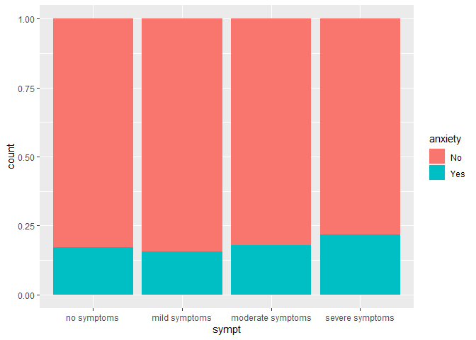
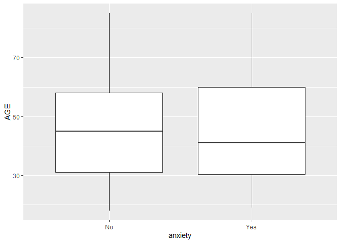
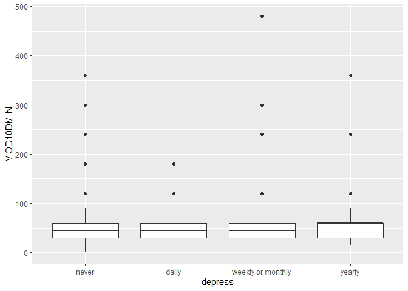
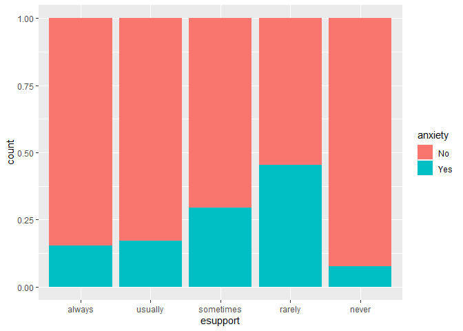
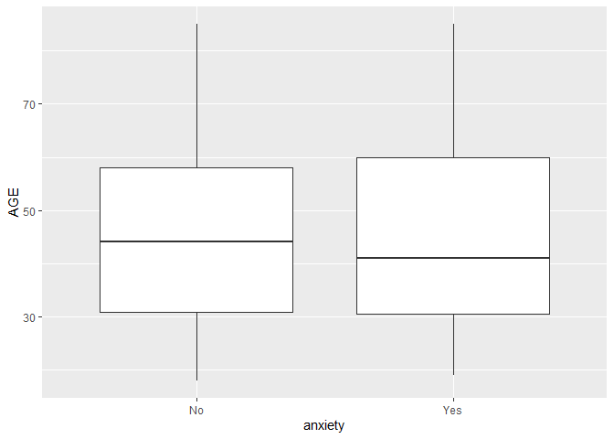
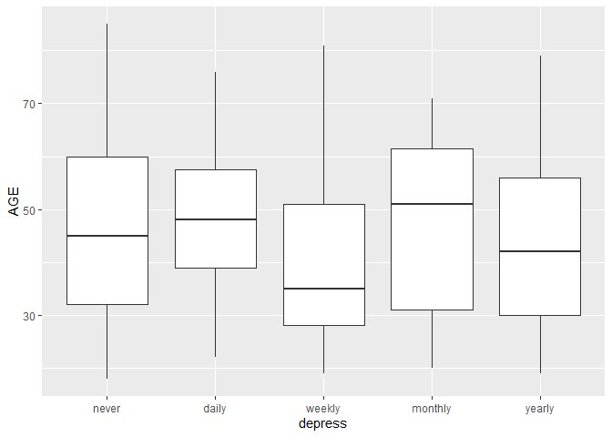
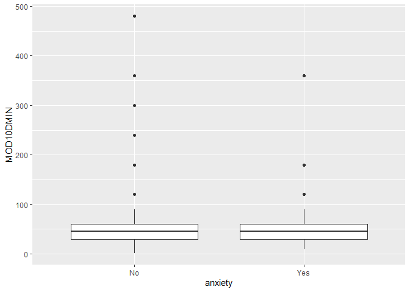

BST 210 Project
================
2022-10-08

# Data Cleaning

``` r
data$AGE[data$AGE == 997] = NA
data$AGE[data$AGE == 999] = NA
data$AGE[data$AGE == 0] = NA
```

``` r
data$sexcat <- NA
data$sexcat[data$SEX == 1] = "male"
data$sexcat[data$SEX == 2] = "female"
data$sexcat <- as.factor(data$sexcat)
```

``` r
data$sexoricat <- NA
data$sexoricat[data$SEXORIEN == 1] = "homosexual"
data$sexoricat[data$SEXORIEN == 2] = "heterosexual"
data$sexoricat[data$SEXORIEN == 3] = "bisexual"
data$sexoricat[data$SEXORIEN == 4] = "other"
data$sexoricat <- factor(data$sexoricat, levels = c("homosexual", "heterosexual", "bisexual", "other"))
```

``` r
data$racecat <- NA
data$racecat[data$RACENEW == 100] = "white"
data$racecat[data$RACENEW == 200] = "black"
data$racecat[data$RACENEW == 300] = "aian"
data$racecat[data$RACENEW == 400] = "asian"
data$racecat[data$RACENEW > 400 & data$RACENEW < 900] = "other"
data$racecat <- as.factor(data$racecat)
```

``` r
data$HOURSWRK[data$HOURSWRK > 95] = NA
data$HOURSWRK[data$HOURSWRK == 0] = NA
```

``` r
data$incomecat <- NA
data$incomecat[data$INCFAM07ON == 11] = "under $34,999"
data$incomecat[data$INCFAM07ON == 12] = "$35,000-$49,999"
data$incomecat[data$INCFAM07ON == 22] = "$50,000-$74,999"
data$incomecat[data$INCFAM07ON == 23] = "$75,000-$99,999"
data$incomecat[data$INCFAM07ON == 24] = "over $100,000"
data$incomecat <- factor(data$incomecat, levels = c("under $34,999", "$35,000-$49,999", "$50,000-$74,999", "$75,000-$99,999", "over $100,000"))
```

``` r
data$healthcat <- NA
data$healthcat[data$HEALTH == 1] = "excellent"
data$healthcat[data$HEALTH == 2] = "very good"
data$healthcat[data$HEALTH == 3] = "good"
data$healthcat[data$HEALTH == 4] = "fair"
data$healthcat[data$HEALTH == 5] = "poor"
data$healthcat <- factor(data$healthcat, levels = c("excellent", "very good", "good", "fair", "poor"))
```

``` r
data$insurcat <- NA
data$insurcat[data$HINOTCOVE == 1] = "no"
data$insurcat[data$HINOTCOVE == 2] = "yes"
data$insurcat <- as.factor(data$insurcat)
```

``` r
data$MOD10DMIN[data$MOD10DMIN %in% c(0, 996, 997, 998, 999)] = NA
```

``` r
data$MOD10FWK[data$MOD10FWK == 0] = NA
data$MOD10FWK[data$MOD10FWK > 90] = NA
```

``` r
data$anxiety <- NA
data$anxiety[data$ANXIETYEV == 1] = "No"
data$anxiety[data$ANXIETYEV == 2] = "Yes"
data$anxiety <- as.factor(data$anxiety)
```

``` r
data$depress <- NA
data$depress[data$DEPFREQ == 1] = "daily"
data$depress[data$DEPFREQ == 2] = "weekly"
data$depress[data$DEPFREQ == 3] = "monthly"
data$depress[data$DEPFREQ == 4] = "yearly"
data$depress[data$DEPFREQ == 5] = "never"
data$depress <- factor(data$depress, levels = c("daily", "weekly", "monthly", "yearly", "never"))
```

``` r
data$esupport <- NA
data$esupport[data$EMOSUPPORT == 1] = "always"
data$esupport[data$EMOSUPPORT == 2] = "usually"
data$esupport[data$EMOSUPPORT == 3] = "sometimes"
data$esupport[data$EMOSUPPORT == 4] = "rarely"
data$esupport[data$EMOSUPPORT == 5] = "never"
data$esupport <- factor(data$esupport, levels = c("always", "usually", "sometimes", "rarely", "never"))
```

``` r
data$covid <- NA
data$covid[data$CVDTESTRSLT == 1] = "No"
data$covid[data$CVDTESTRSLT == 2] = "Yes"
data$covid <- factor(data$covid, levels = c("Yes", "No"))
```

``` r
data$sympt <- NA
data$sympt[data$CVDSYMP == 1] = "no symptoms"
data$sympt[data$CVDSYMP == 2] = "mild symptoms"
data$sympt[data$CVDSYMP == 3] = "moderate symptoms"
data$sympt[data$CVDSYMP == 4] = "severe symptoms"
data$sympt <- factor(data$sympt, levels = c("no symptoms", "mild symptoms", "moderate symptoms", "severe symptoms"))
```

``` r
data %>% 
  select(31:41, AGE, HOURSWRK, MOD10DMIN, MOD10FWK, HISPETH, EDUC) %>% 
  summary()
```

    ##     sexcat             sexoricat      racecat                incomecat    
    ##  female:19865   homosexual  :  571   aian :  287   under $34,999  : 9136  
    ##  male  :17487   heterosexual:29361   asian: 2090   $35,000-$49,999: 4641  
    ##  NA's  :    6   bisexual    :  407   black: 3916   $50,000-$74,999: 6699  
    ##                 other       :  149   other: 1057   $75,000-$99,999: 4855  
    ##                 NA's        : 6870   white:28047   over $100,000  :12027  
    ##                                      NA's : 1961                          
    ##                                                                           
    ##      healthcat     insurcat     anxiety         depress           esupport    
    ##  excellent:11071   no  :34595   No  :26617   daily  : 1284   always   : 8573  
    ##  very good:12269   yes : 2682   Yes : 4900   weekly : 2013   usually  : 4542  
    ##  good     : 9342   NA's:   81   NA's: 5841   monthly: 2459   sometimes: 2226  
    ##  fair     : 3576                             yearly : 9596   rarely   :  747  
    ##  poor     : 1080                             never  :20003   never    :  960  
    ##  NA's     :   20                             NA's   : 2003   NA's     :20310  
    ##                                                                               
    ##   covid                     sympt            AGE         HOURSWRK    
    ##  Yes :  499   no symptoms      :   99   Min.   : 1    Min.   : 1.0   
    ##  No  : 4925   mild symptoms    :  224   1st Qu.:30    1st Qu.:35.0   
    ##  NA's:31934   moderate symptoms:  238   Median :49    Median :40.0   
    ##               severe symptoms  :  132   Mean   :47    Mean   :39.4   
    ##               NA's             :36665   3rd Qu.:66    3rd Qu.:45.0   
    ##                                         Max.   :85    Max.   :95.0   
    ##                                         NA's   :374   NA's   :20223  
    ##    MOD10DMIN         MOD10FWK         HISPETH           EDUC      
    ##  Min.   :  1.00   Min.   : 1.000   Min.   :10.00   Min.   :  0.0  
    ##  1st Qu.: 30.00   1st Qu.: 2.000   1st Qu.:10.00   1st Qu.:201.0  
    ##  Median : 45.00   Median : 4.000   Median :10.00   Median :301.0  
    ##  Mean   : 56.26   Mean   : 4.485   Mean   :13.84   Mean   :270.6  
    ##  3rd Qu.: 60.00   3rd Qu.: 7.000   3rd Qu.:10.00   3rd Qu.:400.0  
    ##  Max.   :720.00   Max.   :28.000   Max.   :93.00   Max.   :999.0  
    ##  NA's   :15376    NA's   :16372

> 4 numeric variables: age, total hours worked last week usually,
> duration of moderate activity 10+ minutues, frequency of moderate
> activity 10+ minutes

> 2 un-cleaned variables: hispanic ethnicity, educational attainment (we
> have not found an efficient manner of collapsing ethnicity and
> education levels)

> Our outcome variables are inbalanced (even after dropping missing
> values) so we might need to downsample or upsample.

# Data Visualization

``` r
data<- drop_na(data) 
```

> We are not considering missing data for now.

``` r
data %>% 
  ggplot(aes(x=covid, fill=anxiety)) +
  geom_bar(position="fill")
```

<!-- -->

``` r
data %>% 
  ggplot(aes(x=covid, fill=depress)) +
  geom_bar(position="fill")
```

<!-- -->

> Covid seems to be negatively associated with anxiety and depression.

``` r
data %>% 
  ggplot(aes(x=sexcat, fill=anxiety)) +
  geom_bar(position="fill")
```

<!-- -->

``` r
data %>% 
  ggplot(aes(x=sexcat, fill=depress)) +
  geom_bar(position="fill")
```

<!-- -->

> Female seems to be positively associated with anxiety and depression.

``` r
data %>% 
  ggplot(aes(x=sexoricat, fill=anxiety)) +
  geom_bar(position="fill")
```

<!-- -->

``` r
data %>% 
  ggplot(aes(x=sexoricat, fill=depress)) +
  geom_bar(position="fill")
```

<!-- -->

> Bisexual seems to be at higher risk of anxiety and depression,
> followed by homosexual and lastly heterosexual.

``` r
data %>% 
  ggplot(aes(x=racecat, fill=anxiety)) +
  geom_bar(position="fill")
```

<!-- -->

``` r
data %>% 
  ggplot(aes(x=racecat, fill=depress)) +
  geom_bar(position="fill")
```

<!-- -->

> White and other seem to be at higher risk of anxiety and depression.

``` r
data %>% 
  ggplot(aes(x=incomecat, fill=anxiety)) +
  geom_bar(position="fill")
```

<!-- -->

``` r
data %>% 
  ggplot(aes(x=incomecat, fill=depress)) +
  geom_bar(position="fill")
```

<!-- -->

> Higher income seems to be a protective factor.

``` r
data %>% 
  ggplot(aes(x=healthcat, fill=anxiety)) +
  geom_bar(position="fill")
```

<!-- -->

``` r
data %>% 
  ggplot(aes(x=healthcat, fill=depress)) +
  geom_bar(position="fill")
```

<!-- -->

> Poor health status is highly associated with anxiety and especially
> depression.

``` r
data %>% 
  ggplot(aes(x=insurcat, fill=anxiety)) +
  geom_bar(position="fill")
```

<!-- -->

``` r
data %>% 
  ggplot(aes(x=insurcat, fill=depress)) +
  geom_bar(position="fill")
```

<!-- -->

> Insurance seems to be a protective factor.

``` r
data %>% 
  ggplot(aes(x=esupport, fill=anxiety)) +
  geom_bar(position="fill")
```

<!-- -->

``` r
data %>% 
  ggplot(aes(x=esupport, fill=depress)) +
  geom_bar(position="fill")
```

<!-- -->

> Participants who rarely or sometimes receive emotional support seem to
> be under higher risk of anxiety and depression.

``` r
data %>% 
  ggplot(aes(x=sympt, fill=anxiety)) +
  geom_bar(position="fill")
```

<!-- -->

``` r
data %>% 
  ggplot(aes(x=sympt, fill=depress)) +
  geom_bar(position="fill")
```

<!-- -->

> Severity of covid symptoms seems to be positively associated with
> anxiety and depression.

``` r
data %>% 
  ggplot(aes(x=anxiety,y=AGE)) +
  geom_boxplot()
```

<!-- -->

``` r
data %>% 
  ggplot(aes(x=depress,y=AGE)) +
  geom_boxplot()
```

<!-- -->

> Participants with anxiety are on average younger, while participants
> who feel depressed daily are older between 40 and 60.

``` r
data %>% 
  ggplot(aes(x=anxiety,y=HOURSWRK)) +
  geom_boxplot()
```

<!-- -->

``` r
data %>% 
  ggplot(aes(x=depress,y=HOURSWRK)) +
  geom_boxplot()
```

<!-- -->

> Participants with anxiety or depression seem to work fewer hours.

``` r
data %>% 
  ggplot(aes(x=anxiety,y=MOD10DMIN)) +
  geom_boxplot()
```

<!-- -->

``` r
data %>% 
  ggplot(aes(x=depress,y=MOD10DMIN)) +
  geom_boxplot()
```

<!-- -->

> Exercise seems to be a protective factor.

``` r
data %>% 
  ggplot(aes(x=anxiety,y=MOD10FWK)) +
  geom_boxplot()
```

<!-- -->

``` r
data %>% 
  ggplot(aes(x=depress,y=MOD10FWK)) +
  geom_boxplot()
```

<!-- -->
