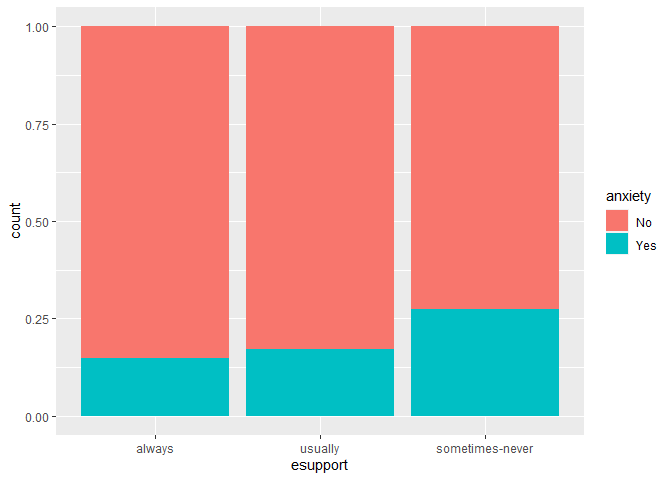
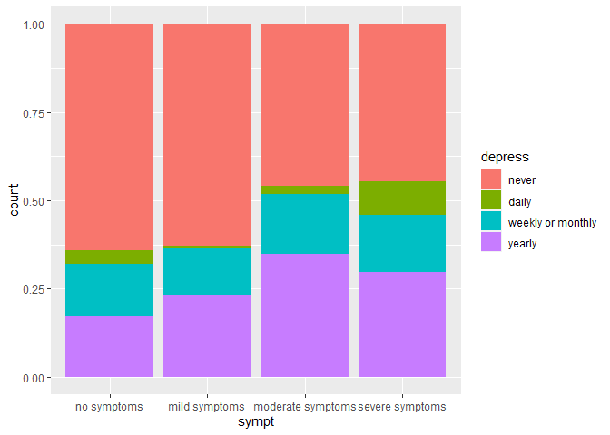
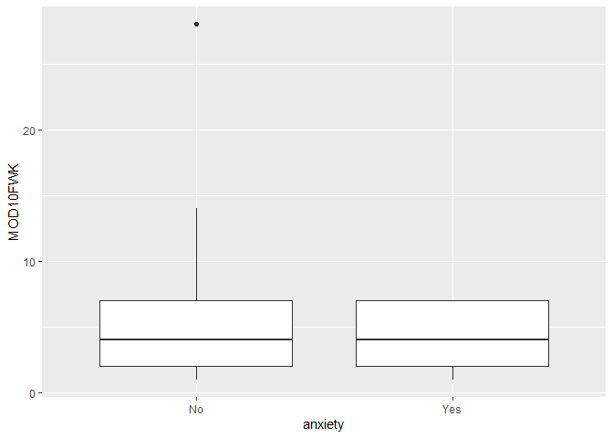
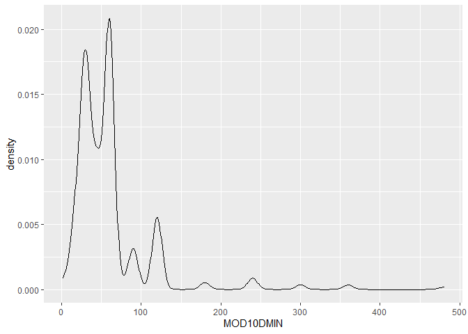

BST 210 Project
================
Yunyang Zhong
2022-10-05

    ##     sexcat             sexoricat      racecat                incomecat    
    ##  female:19865   homosexual  :  571   aian :  287   under $34,999  : 9136  
    ##  male  :17487   heterosexual:29361   asian: 2090   $35,000-$49,999: 4641  
    ##  NA's  :    6   bisexual    :  407   black: 3916   $50,000-$74,999: 6699  
    ##                 other       :  149   other: 1057   $75,000-$99,999: 4855  
    ##                 NA's        : 6870   white:28047   over $100,000  :12027  
    ##                                      NA's : 1961                          
    ##                                                                           
    ##      healthcat     insurcat     anxiety         depress           esupport    
    ##  excellent:11071   no  :34595   No  :26617   daily  : 1284   always   : 8573  
    ##  very good:12269   yes : 2682   Yes : 4900   weekly : 2013   usually  : 4542  
    ##  good     : 9342   NA's:   81   NA's: 5841   monthly: 2459   sometimes: 2226  
    ##  fair     : 3576                             yearly : 9596   rarely   :  747  
    ##  poor     : 1080                             never  :20003   never    :  960  
    ##  NA's     :   20                             NA's   : 2003   NA's     :20310  
    ##                                                                               
    ##   covid                     sympt            AGE         HOURSWRK    
    ##  No  : 4925   no symptoms      :   99   Min.   : 1    Min.   : 1.0   
    ##  Yes :  499   mild symptoms    :  224   1st Qu.:30    1st Qu.:35.0   
    ##  NA's:31934   moderate symptoms:  238   Median :49    Median :40.0   
    ##               severe symptoms  :  132   Mean   :47    Mean   :39.4   
    ##               NA's             :36665   3rd Qu.:66    3rd Qu.:45.0   
    ##                                         Max.   :85    Max.   :95.0   
    ##                                         NA's   :374   NA's   :20223  
    ##    MOD10DMIN         MOD10FWK         HISPETH           EDUC      
    ##  Min.   :  1.00   Min.   : 1.000   Min.   :10.00   Min.   :  0.0  
    ##  1st Qu.: 30.00   1st Qu.: 2.000   1st Qu.:10.00   1st Qu.:201.0  
    ##  Median : 45.00   Median : 4.000   Median :10.00   Median :301.0  
    ##  Mean   : 56.26   Mean   : 4.485   Mean   :13.84   Mean   :270.6  
    ##  3rd Qu.: 60.00   3rd Qu.: 7.000   3rd Qu.:10.00   3rd Qu.:400.0  
    ##  Max.   :720.00   Max.   :28.000   Max.   :93.00   Max.   :999.0  
    ##  NA's   :15376    NA's   :16372

> 4 numeric variables: age, total hours worked last week usually,
> duration of moderate activity 10+ minutues, frequency of moderate
> activity 10+ minutes

> 2 un-cleaned variables: hispanic ethnicity, educational attainment

<!-- --><!-- -->

<!-- --><!-- -->

<!-- --><!-- -->

<!-- --><!-- -->

<!-- --><!-- -->

<!-- --><!-- -->

<!-- --><!-- -->

<!-- --><!-- -->

<!-- --><!-- -->

<!-- --><!-- -->

<!-- --><!-- -->

<!-- --><!-- -->

<!-- --><!-- -->
