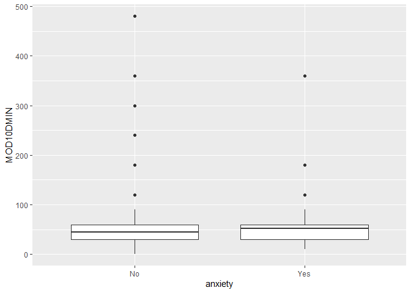
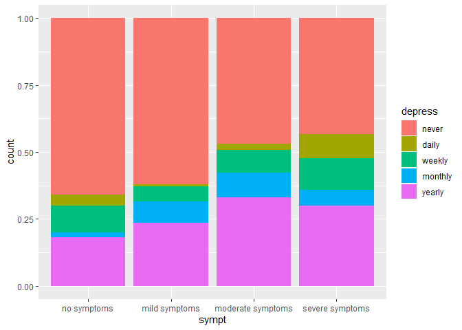
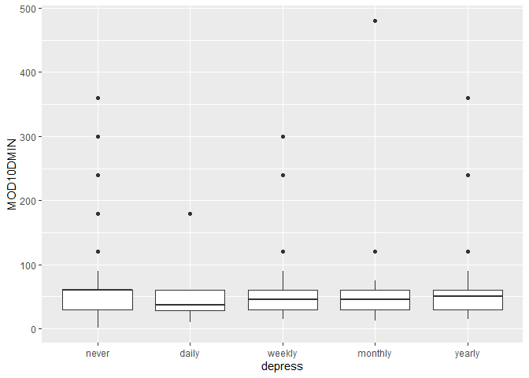
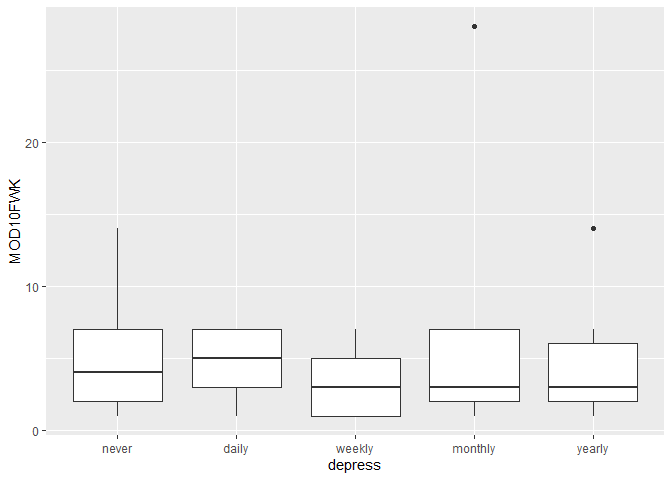
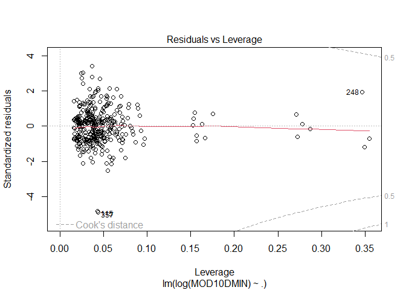
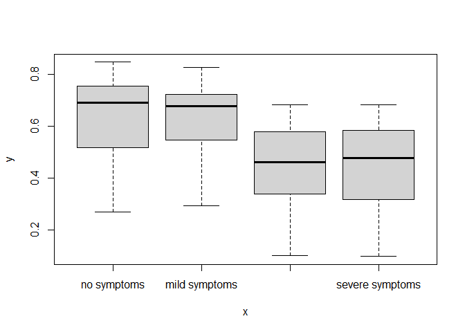
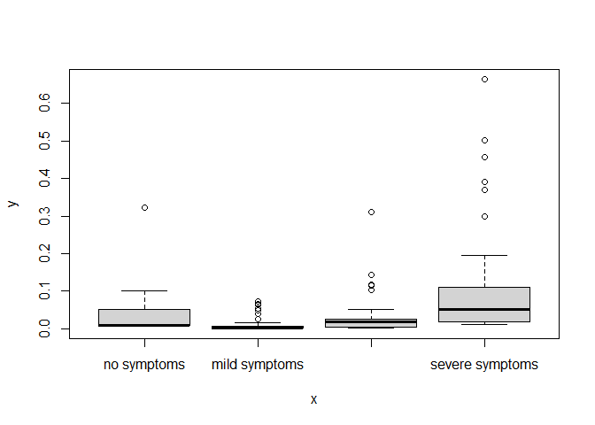

BST 210 Project
================
2022-10-08

# Data Cleaning

``` r
data$AGE[data$AGE == 997] = NA
data$AGE[data$AGE == 999] = NA
data$AGE[data$AGE == 0] = NA

summary(data$AGE)
```

    ##    Min. 1st Qu.  Median    Mean 3rd Qu.    Max.    NA's 
    ##       1      30      49      47      66      85     374

``` r
data$sexcat <- NA
data$sexcat[data$SEX == 1] = "male"
data$sexcat[data$SEX == 2] = "female"
data$sexcat <- as.factor(data$sexcat)

summary(data$sexcat)
```

    ## female   male   NA's 
    ##  19865  17487      6

``` r
data$sexoricat <- NA
data$sexoricat[data$SEXORIEN == 1] = "homosexual"
data$sexoricat[data$SEXORIEN == 2] = "heterosexual"
data$sexoricat[data$SEXORIEN == 3] = "bisexual"
data$sexoricat[data$SEXORIEN == 4] = "other"
data$sexoricat <- factor(data$sexoricat, levels = c("homosexual", "heterosexual", "bisexual", "other"))

summary(data$sexoricat)
```

    ##   homosexual heterosexual     bisexual        other         NA's 
    ##          571        29361          407          149         6870

``` r
data$racecat <- NA
data$racecat[data$RACENEW == 100] = "white"
data$racecat[data$RACENEW == 200] = "black"
data$racecat[data$RACENEW == 300] = "aian"
data$racecat[data$RACENEW == 400] = "asian"
data$racecat[data$RACENEW > 400 & data$RACENEW < 900] = "other"
data$racecat <- as.factor(data$racecat)

summary(data$racecat)
```

    ##  aian asian black other white  NA's 
    ##   287  2090  3916  1057 28047  1961

``` r
data$HOURSWRK[data$HOURSWRK > 95] = NA
data$HOURSWRK[data$HOURSWRK == 0] = NA

summary(data$HOURSWRK)
```

    ##    Min. 1st Qu.  Median    Mean 3rd Qu.    Max.    NA's 
    ##     1.0    35.0    40.0    39.4    45.0    95.0   20223

``` r
data$incomecat <- NA
data$incomecat[data$INCFAM07ON == 11] = "under $34,999"
data$incomecat[data$INCFAM07ON == 12] = "$35,000-$49,999"
data$incomecat[data$INCFAM07ON == 22] = "$50,000-$74,999"
data$incomecat[data$INCFAM07ON == 23] = "$75,000-$99,999"
data$incomecat[data$INCFAM07ON == 24] = "over $100,000"
data$incomecat <- factor(data$incomecat, levels = c("under $34,999", "$35,000-$49,999", "$50,000-$74,999", "$75,000-$99,999", "over $100,000"))

summary(data$incomecat)
```

    ##   under $34,999 $35,000-$49,999 $50,000-$74,999 $75,000-$99,999   over $100,000 
    ##            9136            4641            6699            4855           12027

``` r
data$healthcat <- NA
data$healthcat[data$HEALTH == 1] = "excellent"
data$healthcat[data$HEALTH == 2] = "very good"
data$healthcat[data$HEALTH == 3] = "good"
data$healthcat[data$HEALTH == 4] = "fair"
data$healthcat[data$HEALTH == 5] = "poor"
data$healthcat <- factor(data$healthcat, levels = c("excellent", "very good", "good", "fair", "poor"))

summary(data$healthcat)
```

    ## excellent very good      good      fair      poor      NA's 
    ##     11071     12269      9342      3576      1080        20

``` r
data$insurcat <- NA
data$insurcat[data$HINOTCOVE == 1] = "no"
data$insurcat[data$HINOTCOVE == 2] = "yes"
data$insurcat <- as.factor(data$insurcat)

summary(data$insurcat)
```

    ##    no   yes  NA's 
    ## 34595  2682    81

``` r
data$MOD10DMIN[data$MOD10DMIN %in% c(0, 996, 997, 998, 999)] = NA

summary(data$MOD10DMIN)
```

    ##    Min. 1st Qu.  Median    Mean 3rd Qu.    Max.    NA's 
    ##    1.00   30.00   45.00   56.26   60.00  720.00   15376

``` r
data$MOD10FWK[data$MOD10FWK == 0] = NA
data$MOD10FWK[data$MOD10FWK > 90] = NA

summary(data$MOD10FWK)
```

    ##    Min. 1st Qu.  Median    Mean 3rd Qu.    Max.    NA's 
    ##   1.000   2.000   4.000   4.485   7.000  28.000   16372

``` r
data$anxiety <- NA
data$anxiety[data$ANXIETYEV == 1] = "No"
data$anxiety[data$ANXIETYEV == 2] = "Yes"
data$anxiety <- as.factor(data$anxiety)

summary(data$anxiety)
```

    ##    No   Yes  NA's 
    ## 26617  4900  5841

``` r
data$depress <- NA
data$depress[data$DEPFREQ == 1] = "daily"
data$depress[data$DEPFREQ == 2] = "weekly"
data$depress[data$DEPFREQ == 3] = "monthly"
data$depress[data$DEPFREQ == 4] = "yearly"
data$depress[data$DEPFREQ == 5] = "never"
data$depress <- factor(data$depress, levels = c("never", "daily", "weekly", "monthly", "yearly"))

summary(data$depress)
```

    ##   never   daily  weekly monthly  yearly    NA's 
    ##   20003    1284    2013    2459    9596    2003

``` r
data$esupport <- NA
data$esupport[data$EMOSUPPORT == 1] = "always"
data$esupport[data$EMOSUPPORT == 2] = "usually"
data$esupport[data$EMOSUPPORT == 3] = "sometimes"
data$esupport[data$EMOSUPPORT == 4] = "rarely"
data$esupport[data$EMOSUPPORT == 5] = "never"
data$esupport <- factor(data$esupport, levels = c("always", "usually", "sometimes", "rarely", "never"))

summary(data$esupport)
```

    ##    always   usually sometimes    rarely     never      NA's 
    ##      8573      4542      2226       747       960     20310

``` r
data$covid <- NA
data$covid[data$CVDTESTRSLT == 1] = "No"
data$covid[data$CVDTESTRSLT == 2] = "Yes"
data$covid <- as.factor(data$covid)

summary(data$covid)
```

    ##    No   Yes  NA's 
    ##  4925   499 31934

``` r
data$sympt <- NA
data$sympt[data$CVDSYMP == 1] = "no symptoms"
data$sympt[data$CVDSYMP == 2] = "mild symptoms"
data$sympt[data$CVDSYMP == 3] = "moderate symptoms"
data$sympt[data$CVDSYMP == 4] = "severe symptoms"
data$sympt <- factor(data$sympt, levels = c("no symptoms", "mild symptoms", "moderate symptoms", "severe symptoms"))

summary(data$sympt)
```

    ##       no symptoms     mild symptoms moderate symptoms   severe symptoms 
    ##                99               224               238               132 
    ##              NA's 
    ##             36665

``` r
data$reg <- NA
data$reg[data$REGION == 1] = "northeast"
data$reg[data$REGION == 2] = "midwest"
data$reg[data$REGION == 3] = "south"
data$reg[data$REGION == 4] = "west"
data$reg <- factor(data$reg, levels = c("northeast", "midwest", "south", "west"))

summary(data$reg)
```

    ## northeast   midwest     south      west 
    ##      6604      8393     12929      9432

``` r
data <- data %>% 
  select(32:43, AGE, MOD10DMIN, MOD10FWK, -sexoricat, -insurcat, -covid)

data %>% 
  summary()
```

    ##     sexcat       racecat                incomecat         healthcat    
    ##  female:19865   aian :  287   under $34,999  : 9136   excellent:11071  
    ##  male  :17487   asian: 2090   $35,000-$49,999: 4641   very good:12269  
    ##  NA's  :    6   black: 3916   $50,000-$74,999: 6699   good     : 9342  
    ##                 other: 1057   $75,000-$99,999: 4855   fair     : 3576  
    ##                 white:28047   over $100,000  :12027   poor     : 1080  
    ##                 NA's : 1961                           NA's     :   20  
    ##                                                                        
    ##  anxiety         depress           esupport                   sympt      
    ##  No  :26617   never  :20003   always   : 8573   no symptoms      :   99  
    ##  Yes : 4900   daily  : 1284   usually  : 4542   mild symptoms    :  224  
    ##  NA's: 5841   weekly : 2013   sometimes: 2226   moderate symptoms:  238  
    ##               monthly: 2459   rarely   :  747   severe symptoms  :  132  
    ##               yearly : 9596   never    :  960   NA's             :36665  
    ##               NA's   : 2003   NA's     :20310                            
    ##                                                                          
    ##         reg             AGE        MOD10DMIN         MOD10FWK     
    ##  northeast: 6604   Min.   : 1    Min.   :  1.00   Min.   : 1.000  
    ##  midwest  : 8393   1st Qu.:30    1st Qu.: 30.00   1st Qu.: 2.000  
    ##  south    :12929   Median :49    Median : 45.00   Median : 4.000  
    ##  west     : 9432   Mean   :47    Mean   : 56.26   Mean   : 4.485  
    ##                    3rd Qu.:66    3rd Qu.: 60.00   3rd Qu.: 7.000  
    ##                    Max.   :85    Max.   :720.00   Max.   :28.000  
    ##                    NA's   :374   NA's   :15376    NA's   :16372

``` r
dim(data)[1]*0.05
```

    ## [1] 1867.9

``` r
dim(data %>% drop_na())[1]
```

    ## [1] 371

> 3 numeric variables: age, duration of moderate activity 10+ minutues,
> frequency of moderate activity 10+ minutes

> Our outcome variables are inbalanced (even after dropping missing
> values) so we might need to downsample or upsample.

# Data Visualization

``` r
data <- drop_na(data) 
```

> We are not considering missing data for now.

``` r
data %>% 
  ggplot(aes(x=sexcat, fill=anxiety)) +
  geom_bar(position="fill")
```

<!-- -->

``` r
data %>% 
  ggplot(aes(x=sexcat, fill=depress)) +
  geom_bar(position="fill")
```

<!-- -->

> Female seems to be positively associated with anxiety and depression.

``` r
data %>% 
  ggplot(aes(x=racecat, fill=anxiety)) +
  geom_bar(position="fill")
```

<!-- -->

``` r
data %>% 
  ggplot(aes(x=racecat, fill=depress)) +
  geom_bar(position="fill")
```

<!-- -->

> White and other seem to be at higher risk of anxiety and depression.

``` r
data %>% 
  ggplot(aes(x=incomecat, fill=anxiety)) +
  geom_bar(position="fill")
```

<!-- -->

``` r
data %>% 
  ggplot(aes(x=incomecat, fill=depress)) +
  geom_bar(position="fill")
```

<!-- -->

> Higher income seems to be a protective factor.

``` r
data %>% 
  ggplot(aes(x=healthcat, fill=anxiety)) +
  geom_bar(position="fill")
```

<!-- -->

``` r
data %>% 
  ggplot(aes(x=healthcat, fill=depress)) +
  geom_bar(position="fill")
```

<!-- -->

> Poor health status is highly associated with anxiety and especially
> depression.

``` r
data %>% 
  ggplot(aes(x=esupport, fill=anxiety)) +
  geom_bar(position="fill")
```

<!-- -->

``` r
data %>% 
  ggplot(aes(x=esupport, fill=depress)) +
  geom_bar(position="fill")
```

<!-- -->

> Participants who rarely or sometimes receive emotional support seem to
> be under higher risk of anxiety and depression.

``` r
data %>% 
  ggplot(aes(x=sympt, fill=anxiety)) +
  geom_bar(position="fill")
```

<!-- -->

``` r
data %>% 
  ggplot(aes(x=sympt, fill=depress)) +
  geom_bar(position="fill")
```

<!-- -->

> Severity of covid symptoms seems to be positively associated with
> anxiety and depression.

``` r
data %>% 
  ggplot(aes(x=anxiety,y=AGE)) +
  geom_boxplot()
```

    ## Don't know how to automatically pick scale for object of type haven_labelled/vctrs_vctr/double. Defaulting to continuous.

<!-- -->

``` r
data %>% 
  ggplot(aes(x=depress,y=AGE)) +
  geom_boxplot()
```

    ## Don't know how to automatically pick scale for object of type haven_labelled/vctrs_vctr/double. Defaulting to continuous.

<!-- -->

> Participants with anxiety are on average younger, while participants
> who feel depressed daily are older between 40 and 60.

``` r
data %>% 
  ggplot(aes(x=anxiety,y=MOD10DMIN)) +
  geom_boxplot()
```

    ## Don't know how to automatically pick scale for object of type haven_labelled/vctrs_vctr/double. Defaulting to continuous.

<!-- -->

``` r
data %>% 
  ggplot(aes(x=depress,y=MOD10DMIN)) +
  geom_boxplot()
```

    ## Don't know how to automatically pick scale for object of type haven_labelled/vctrs_vctr/double. Defaulting to continuous.

<!-- -->

> Exercise seems to be a protective factor.

``` r
data %>% 
  ggplot(aes(x=anxiety,y=MOD10FWK)) +
  geom_boxplot()
```

    ## Don't know how to automatically pick scale for object of type haven_labelled/vctrs_vctr/double. Defaulting to continuous.

<!-- -->

``` r
data %>% 
  ggplot(aes(x=depress,y=MOD10FWK)) +
  geom_boxplot()
```

    ## Don't know how to automatically pick scale for object of type haven_labelled/vctrs_vctr/double. Defaulting to continuous.

<!-- -->

``` r
data %>% 
  ggplot(aes(x = AGE)) +
  geom_density()
```

    ## Don't know how to automatically pick scale for object of type haven_labelled/vctrs_vctr/double. Defaulting to continuous.

<!-- -->

``` r
data %>% 
  ggplot(aes(x = MOD10DMIN)) +
  geom_density()
```

    ## Don't know how to automatically pick scale for object of type haven_labelled/vctrs_vctr/double. Defaulting to continuous.

<!-- -->

``` r
data %>% 
  ggplot(aes(x = MOD10FWK)) +
  geom_density()
```

    ## Don't know how to automatically pick scale for object of type haven_labelled/vctrs_vctr/double. Defaulting to continuous.

<!-- -->

# Modeling

## Anxiety - logistic & multinomial

``` r
data_logis <- data %>% select(-depress) %>% filter(!is.na(anxiety))

logis <- glm(anxiety ~ ., family = binomial, data = data_logis)
AIC(logis)
```

    ## [1] 368.0213

``` r
BIC(logis)
```

    ## [1] 473.7588

``` r
tlogis = tidy(logis)
options(scipen = 999)
tlogis
```

    ## # A tibble: 27 × 5
    ##    term                     estimate std.error statistic p.value
    ##    <chr>                       <dbl>     <dbl>     <dbl>   <dbl>
    ##  1 (Intercept)               -15.7     712.      -0.0221   0.982
    ##  2 sexcatmale                 -0.439     0.303   -1.45     0.147
    ##  3 racecatasian               12.9     712.       0.0182   0.986
    ##  4 racecatblack               13.2     712.       0.0185   0.985
    ##  5 racecatother               13.5     712.       0.0189   0.985
    ##  6 racecatwhite               14.3     712.       0.0201   0.984
    ##  7 incomecat$35,000-$49,999    0.218     0.485    0.449    0.653
    ##  8 incomecat$50,000-$74,999   -0.191     0.493   -0.387    0.698
    ##  9 incomecat$75,000-$99,999   -0.746     0.657   -1.13     0.256
    ## 10 incomecatover $100,000     -0.435     0.439   -0.992    0.321
    ## # … with 17 more rows

``` r
tlogis$term[tlogis$p.value < 0.05]
```

    ## character(0)

``` r
# hoslem.test(logis$anxiety,fitted(logis),g=10)
 
predprob <- predict(logis,type=c("response"))
# roccurve <- roc(data_logis$anxiety ~ predprob)
# plot(roccurve,col="red")
# auc(roccurve)
 
logLik(logis)
```

    ## 'log Lik.' -157.0107 (df=27)

``` r
VIF(logis)
```

    ##               GVIF Df GVIF^(1/(2*Df))
    ## sexcat    1.066830  1        1.032874
    ## racecat   1.284668  4        1.031808
    ## incomecat 1.434708  4        1.046154
    ## healthcat 1.424535  4        1.045223
    ## esupport  1.376902  4        1.040789
    ## sympt     1.283788  3        1.042515
    ## reg       1.203921  3        1.031414
    ## AGE       1.105969  1        1.051651
    ## MOD10DMIN 1.079982  1        1.039222
    ## MOD10FWK  1.051484  1        1.025419

``` r
data_multi <- data %>%
  select(-depress) %>%
  mutate(anxiety = case_when(is.na(anxiety) ~ "Unknown",
                             TRUE ~ as.character(anxiety)))

multi <- multinom(anxiety ~ ., data = data_multi)
```

    ## # weights:  28 (27 variable)
    ## initial  value 257.157604 
    ## iter  10 value 158.853124
    ## iter  20 value 157.402167
    ## iter  30 value 157.018179
    ## iter  40 value 157.010659
    ## final  value 157.010652 
    ## converged

``` r
AIC(multi)
```

    ## [1] 368.0213

``` r
BIC(multi)
```

    ## [1] 473.7588

``` r
tmulti = tidy(multi)
options(scipen = 999)
tmulti
```

    ## # A tibble: 27 × 6
    ##    y.level term                     estimate std.error statistic   p.value
    ##    <chr>   <chr>                       <dbl>     <dbl>     <dbl>     <dbl>
    ##  1 1       (Intercept)               -15.4       0.718   -21.4   7.54e-102
    ##  2 1       sexcatmale                 -0.439     0.303    -1.45  1.47e-  1
    ##  3 1       racecatasian               12.6       0.906    13.9   5.11e- 44
    ##  4 1       racecatblack               12.9       0.584    22.1   6.00e-108
    ##  5 1       racecatother               13.2       0.937    14.1   6.92e- 45
    ##  6 1       racecatwhite               14.0       0.421    33.3   1.89e-242
    ##  7 1       incomecat$35,000-$49,999    0.218     0.485     0.449 6.53e-  1
    ##  8 1       incomecat$50,000-$74,999   -0.191     0.493    -0.387 6.98e-  1
    ##  9 1       incomecat$75,000-$99,999   -0.746     0.657    -1.13  2.56e-  1
    ## 10 1       incomecatover $100,000     -0.435     0.439    -0.992 3.21e-  1
    ## # … with 17 more rows

``` r
tmulti$term[tmulti$p.value < 0.05]
```

    ## [1] "(Intercept)"  "racecatasian" "racecatblack" "racecatother" "racecatwhite"

## Depression - multinomial & ordinal

``` r
multi <- multinom(depress ~ ., data = data %>% select(-anxiety))
```

    ## # weights:  140 (108 variable)
    ## initial  value 597.101466 
    ## iter  10 value 464.812178
    ## iter  20 value 383.293209
    ## iter  30 value 365.637024
    ## iter  40 value 361.064930
    ## iter  50 value 360.002111
    ## iter  60 value 359.863326
    ## iter  70 value 359.792446
    ## iter  80 value 359.749328
    ## iter  90 value 359.740590
    ## iter 100 value 359.738312
    ## final  value 359.738312 
    ## stopped after 100 iterations

``` r
AIC(multi)
```

    ## [1] 935.4766

``` r
BIC(multi)
```

    ## [1] 1358.426

``` r
tmulti = tidy(multi)
options(scipen = 999)
tmulti
```

    ## # A tibble: 108 × 6
    ##    y.level term                     estimate std.error statistic     p.value
    ##    <chr>   <chr>                       <dbl>     <dbl>     <dbl>       <dbl>
    ##  1 daily   (Intercept)               -94.1    1.11e+ 0 -8.47e+ 1 0          
    ##  2 daily   sexcatmale                 -0.372  8.93e- 1 -4.17e- 1 0.677      
    ##  3 daily   racecatasian              -51.8    1.45e-10 -3.56e+11 0          
    ##  4 daily   racecatblack                3.97   9.73e- 1  4.08e+ 0 0.0000451  
    ##  5 daily   racecatother              -24.5    4.76e-11 -5.14e+11 0          
    ##  6 daily   racecatwhite                4.85   9.23e- 1  5.26e+ 0 0.000000146
    ##  7 daily   incomecat$35,000-$49,999   -0.321  1.29e+ 0 -2.50e- 1 0.803      
    ##  8 daily   incomecat$50,000-$74,999   -0.860  1.35e+ 0 -6.39e- 1 0.523      
    ##  9 daily   incomecat$75,000-$99,999   -1.07   1.65e+ 0 -6.49e- 1 0.516      
    ## 10 daily   incomecatover $100,000     -2.81   1.62e+ 0 -1.73e+ 0 0.0835     
    ## # … with 98 more rows

``` r
tmulti$term[tmulti$p.value < 0.05]
```

    ##  [1] "(Intercept)"            "racecatasian"           "racecatblack"          
    ##  [4] "racecatother"           "racecatwhite"           "healthcatvery good"    
    ##  [7] "healthcatgood"          "healthcatfair"          "healthcatpoor"         
    ## [10] "esupportusually"        "esupportrarely"         "esupportnever"         
    ## [13] "regmidwest"             "regsouth"               "regwest"               
    ## [16] "(Intercept)"            NA                       "racecatblack"          
    ## [19] "racecatother"           "racecatwhite"           "healthcatfair"         
    ## [22] "esupportusually"        "esupportsometimes"      NA                      
    ## [25] "AGE"                    "(Intercept)"            "racecatasian"          
    ## [28] "racecatblack"           "racecatother"           "racecatwhite"          
    ## [31] "healthcatpoor"          "esupportsometimes"      "healthcatpoor"         
    ## [34] "esupportusually"        "esupportsometimes"      "symptmoderate symptoms"
    ## [37] "symptsevere symptoms"   "AGE"

``` r
ordin <- vglm(depress ~ ., cumulative(parallel=TRUE, reverse=TRUE), data = data %>% select(-anxiety))
AIC(ordin)
```

    ## [1] 895.0824

``` r
BIC(ordin)
```

    ## [1] 1012.568

``` r
data$depressdaily <- ifelse(data$depress=="daily", 1, 0)
data$depressnever <- ifelse(data$depress=="never", 1, 0)

moddaily <- glm(depressdaily ~ ., family=binomial, data=data %>% select(-anxiety, -depress, -depressnever)) 
summary(moddaily)
```

    ## 
    ## Call:
    ## glm(formula = depressdaily ~ ., family = binomial, data = data %>% 
    ##     select(-anxiety, -depress, -depressnever))
    ## 
    ## Deviance Residuals: 
    ##      Min        1Q    Median        3Q       Max  
    ## -1.44243  -0.10219  -0.02284  -0.00001   2.51375  
    ## 
    ## Coefficients:
    ##                               Estimate    Std. Error z value  Pr(>|z|)    
    ## (Intercept)                -55.6139641 13013.5588763  -0.004    0.9966    
    ## sexcatmale                  -0.1449715     0.8799067  -0.165    0.8691    
    ## racecatasian                -0.9059373 13110.8334369   0.000    0.9999    
    ## racecatblack                13.7312830 12474.7896100   0.001    0.9991    
    ## racecatother                -3.1483305 15290.1786253   0.000    0.9998    
    ## racecatwhite                14.5065537 12474.7894863   0.001    0.9991    
    ## incomecat$35,000-$49,999    -0.4639863     1.2560485  -0.369    0.7118    
    ## incomecat$50,000-$74,999    -1.1756834     1.3245798  -0.888    0.3748    
    ## incomecat$75,000-$99,999    -0.7379477     1.6208054  -0.455    0.6489    
    ## incomecatover $100,000      -2.5994537     1.6071584  -1.617    0.1058    
    ## healthcatvery good          16.8205503  2331.7069113   0.007    0.9942    
    ## healthcatgood               17.2040452  2331.7070140   0.007    0.9941    
    ## healthcatfair               17.6418195  2331.7070986   0.008    0.9940    
    ## healthcatpoor               19.6929442  2331.7077152   0.008    0.9933    
    ## esupportusually              2.2475212     1.1089575   2.027    0.0427 *  
    ## esupportsometimes            0.6350193     1.4568389   0.436    0.6629    
    ## esupportrarely               6.2785042     1.5981981   3.928 0.0000855 ***
    ## esupportnever              -17.2905099  6838.8468486  -0.003    0.9980    
    ## symptmild symptoms          -2.4888630     1.8918565  -1.316    0.1883    
    ## symptmoderate symptoms      -0.5939654     1.4374290  -0.413    0.6795    
    ## symptsevere symptoms         1.7904263     1.3502650   1.326    0.1848    
    ## regmidwest                  19.8486305  2880.1888066   0.007    0.9945    
    ## regsouth                    19.1717415  2880.1888898   0.007    0.9947    
    ## regwest                     18.5965252  2880.1888972   0.006    0.9948    
    ## AGE                          0.0073883     0.0237844   0.311    0.7561    
    ## MOD10DMIN                    0.0008439     0.0117054   0.072    0.9425    
    ## MOD10FWK                     0.1022928     0.1491542   0.686    0.4928    
    ## ---
    ## Signif. codes:  0 '***' 0.001 '**' 0.01 '*' 0.05 '.' 0.1 ' ' 1
    ## 
    ## (Dispersion parameter for binomial family taken to be 1)
    ## 
    ##     Null deviance: 105.96  on 370  degrees of freedom
    ## Residual deviance:  51.68  on 344  degrees of freedom
    ## AIC: 105.68
    ## 
    ## Number of Fisher Scoring iterations: 20

``` r
modnever <- glm(depressnever ~ ., family=binomial, data=data %>% select(-anxiety, -depress, -depressdaily)) 
summary(modnever)
```

    ## 
    ## Call:
    ## glm(formula = depressnever ~ ., family = binomial, data = data %>% 
    ##     select(-anxiety, -depress, -depressdaily))
    ## 
    ## Deviance Residuals: 
    ##     Min       1Q   Median       3Q      Max  
    ## -2.1554  -1.0154   0.5390   0.9748   2.1138  
    ## 
    ## Coefficients:
    ##                           Estimate Std. Error z value  Pr(>|z|)    
    ## (Intercept)               1.627709   1.364515   1.193   0.23291    
    ## sexcatmale                0.305706   0.239117   1.278   0.20108    
    ## racecatasian             -0.385400   1.365343  -0.282   0.77773    
    ## racecatblack             -1.154605   1.285920  -0.898   0.36925    
    ## racecatother             -1.643730   1.456311  -1.129   0.25903    
    ## racecatwhite             -1.219332   1.216275  -1.003   0.31610    
    ## incomecat$35,000-$49,999 -0.355279   0.424595  -0.837   0.40273    
    ## incomecat$50,000-$74,999 -0.539171   0.405481  -1.330   0.18361    
    ## incomecat$75,000-$99,999  0.459963   0.473256   0.972   0.33110    
    ## incomecatover $100,000    0.319585   0.359866   0.888   0.37451    
    ## healthcatvery good       -0.357671   0.316602  -1.130   0.25860    
    ## healthcatgood            -0.457322   0.334885  -1.366   0.17206    
    ## healthcatfair            -0.552867   0.486728  -1.136   0.25600    
    ## healthcatpoor            -0.869124   1.537324  -0.565   0.57184    
    ## esupportusually          -0.838137   0.273287  -3.067   0.00216 ** 
    ## esupportsometimes        -1.513794   0.388882  -3.893 0.0000991 ***
    ## esupportrarely           -2.084081   0.844557  -2.468   0.01360 *  
    ## esupportnever             0.169091   0.663458   0.255   0.79883    
    ## symptmild symptoms       -0.285756   0.401879  -0.711   0.47705    
    ## symptmoderate symptoms   -0.865385   0.401528  -2.155   0.03114 *  
    ## symptsevere symptoms     -0.997813   0.435422  -2.292   0.02193 *  
    ## regmidwest               -0.081963   0.371440  -0.221   0.82535    
    ## regsouth                  0.513482   0.356031   1.442   0.14923    
    ## regwest                   0.056187   0.396942   0.142   0.88744    
    ## AGE                       0.018559   0.007386   2.513   0.01198 *  
    ## MOD10DMIN                 0.000767   0.002295   0.334   0.73822    
    ## MOD10FWK                 -0.038488   0.040961  -0.940   0.34742    
    ## ---
    ## Signif. codes:  0 '***' 0.001 '**' 0.01 '*' 0.05 '.' 0.1 ' ' 1
    ## 
    ## (Dispersion parameter for binomial family taken to be 1)
    ## 
    ##     Null deviance: 512.05  on 370  degrees of freedom
    ## Residual deviance: 439.36  on 344  degrees of freedom
    ## AIC: 493.36
    ## 
    ## Number of Fisher Scoring iterations: 4

``` r
coef(moddaily)[19:21]
```

    ##     symptmild symptoms symptmoderate symptoms   symptsevere symptoms 
    ##             -2.4888630             -0.5939654              1.7904263

``` r
coef(moddaily)[19] + c(-1, 1)*1.96*sqrt(vcov(moddaily)[19,19])
```

    ## [1] -6.196902  1.219176

``` r
coef(moddaily)[20] + c(-1, 1)*1.96*sqrt(vcov(moddaily)[20,20])
```

    ## [1] -3.411326  2.223395

``` r
coef(moddaily)[21] + c(-1, 1)*1.96*sqrt(vcov(moddaily)[21,21])
```

    ## [1] -0.8560931  4.4369457

``` r
coef(modnever)[19:21]
```

    ##     symptmild symptoms symptmoderate symptoms   symptsevere symptoms 
    ##             -0.2857563             -0.8653852             -0.9978130

``` r
coef(modnever)[19] + c(-1, 1)*1.96*sqrt(vcov(modnever)[19,19])
```

    ## [1] -1.0734388  0.5019261

``` r
coef(modnever)[20] + c(-1, 1)*1.96*sqrt(vcov(modnever)[20,20])
```

    ## [1] -1.65237974 -0.07839063

``` r
coef(modnever)[21] + c(-1, 1)*1.96*sqrt(vcov(modnever)[21,21])
```

    ## [1] -1.8512400 -0.1443859

## Physical activity

``` r
filtered_data <- data |> 
  dplyr::select(sexcat, racecat, incomecat, healthcat, 
         sympt, AGE, MOD10DMIN, 
         MOD10FWK)

complete_data <- filtered_data |> 
  drop_na()
```

> We have 8 variables in our data set with 378 complete cases.

> We are interested in modeling the relationship between the severity of
> covid-19 symptoms and the duration of moderate physical activity. In
> our model, we are adjusting for sex, race, income, health, age.

``` r
#univariate
hist(complete_data$MOD10DMIN)
```

<!-- -->

``` r
hist(log(complete_data$MOD10DMIN))
```

<!-- -->

``` r
hist(complete_data$AGE)
```

<!-- -->

``` r
barplot(prop.table(table(complete_data$sympt)))
```

<!-- -->

``` r
barplot(prop.table(table(complete_data$sexcat)))
```

<!-- -->

``` r
barplot(prop.table(table(complete_data$racecat)))
```

<!-- -->

``` r
barplot(prop.table(table(complete_data$incomecat)))
```

<!-- -->

``` r
barplot(prop.table(table(complete_data$healthcat)))
```

<!-- -->

> We see that the duration of moderate physical activity is heavily
> right skewed so we log transformed it.

``` r
#bivariate
scatter.smooth(complete_data$AGE, log(complete_data$MOD10DMIN))
```

<!-- -->

``` r
boxplot(complete_data$MOD10DMIN ~ complete_data$sympt)
```

<!-- -->

``` r
boxplot(complete_data$MOD10DMIN ~ complete_data$racecat)
```

<!-- -->

``` r
boxplot(complete_data$MOD10DMIN ~ complete_data$incomecat)
```

<!-- -->

``` r
boxplot(complete_data$MOD10DMIN ~ complete_data$healthcat)
```

<!-- -->

``` r
# checking for collinearity between health and covid symptoms
chisq.test(complete_data$healthcat, complete_data$sympt)
```

    ## 
    ##  Pearson's Chi-squared test
    ## 
    ## data:  complete_data$healthcat and complete_data$sympt
    ## X-squared = 19.957, df = 12, p-value = 0.06791

> There does not appear to be a linear relationship between age and
> log(MOD10DMIN) so we might not want to include it in this model. We
> will keep it for this hw checkin and do some flexible modeling below.

``` r
lm1 <- lm(log(MOD10DMIN) ~ .,data = complete_data |> dplyr::select(-MOD10FWK))
# lm1_reg <- lm(log(MOD10DMIN)~ .,data = complete_data)
tidy(lm1)
```

    ## # A tibble: 18 × 5
    ##    term                     estimate std.error statistic  p.value
    ##    <chr>                       <dbl>     <dbl>     <dbl>    <dbl>
    ##  1 (Intercept)               4.22      0.367     11.5    3.24e-26
    ##  2 sexcatmale               -0.0270    0.0702    -0.385  7.00e- 1
    ##  3 racecatasian             -0.0741    0.368     -0.201  8.41e- 1
    ##  4 racecatblack             -0.0884    0.356     -0.249  8.04e- 1
    ##  5 racecatother             -0.0952    0.410     -0.232  8.16e- 1
    ##  6 racecatwhite             -0.0702    0.337     -0.209  8.35e- 1
    ##  7 incomecat$35,000-$49,999 -0.248     0.126     -1.97   4.97e- 2
    ##  8 incomecat$50,000-$74,999  0.0881    0.118      0.747  4.56e- 1
    ##  9 incomecat$75,000-$99,999 -0.00326   0.135     -0.0241 9.81e- 1
    ## 10 incomecatover $100,000   -0.0109    0.104     -0.105  9.16e- 1
    ## 11 healthcatvery good       -0.131     0.0915    -1.43   1.53e- 1
    ## 12 healthcatgood            -0.199     0.0971    -2.05   4.14e- 2
    ## 13 healthcatfair            -0.318     0.140     -2.27   2.37e- 2
    ## 14 healthcatpoor            -0.319     0.390     -0.817  4.14e- 1
    ## 15 symptmild symptoms        0.0709    0.113      0.628  5.30e- 1
    ## 16 symptmoderate symptoms    0.0613    0.112      0.545  5.86e- 1
    ## 17 symptsevere symptoms      0.170     0.125      1.36   1.74e- 1
    ## 18 AGE                      -0.00426   0.00212   -2.01   4.56e- 2

``` r
# summary(lm1)
```

> In the full model, we see that after adjusting for the effect of the
> other variables, none of the COVID symptom levels have a statistically
> significant effect on the duration of moderate physical activity.

``` r
plot(lm1, 1:6)
```

<!-- --><!-- --><!-- --><!-- --><!-- --><!-- -->

> From the residual plots, it seems linearity, normality, and equal
> variance holds.

``` r
gam1 <- gam(log(MOD10DMIN) ~ s(AGE, 4) + .,data = complete_data |> dplyr::select(-MOD10FWK))
anova(lm1, gam1)
```

    ## Analysis of Variance Table
    ## 
    ## Model 1: log(MOD10DMIN) ~ sexcat + racecat + incomecat + healthcat + sympt + 
    ##     AGE
    ## Model 2: log(MOD10DMIN) ~ s(AGE, 4) + (sexcat + racecat + incomecat + 
    ##     healthcat + sympt + AGE)
    ##   Res.Df    RSS     Df Sum of Sq      F  Pr(>F)  
    ## 1    353 151.63                                  
    ## 2    350 148.11 2.9997    3.5238 2.7759 0.04127 *
    ## ---
    ## Signif. codes:  0 '***' 0.001 '**' 0.01 '*' 0.05 '.' 0.1 ' ' 1

> It seems that it is better to use the GAM model instead of the linear
> term for Age

``` r
hist(complete_data$MOD10FWK)
```

<!-- -->

``` r
hist(log(complete_data$MOD10FWK))
```

<!-- -->

``` r
mean(complete_data$MOD10FWK)
```

    ## [1] 4.16442

``` r
var(complete_data$MOD10FWK)
```

    ## [1] 8.186406

``` r
mod_poisson1 <- glm(MOD10FWK ~ . , data = complete_data |> dplyr::select(-MOD10DMIN) , family = poisson())
tidy(mod_poisson1)
```

    ## # A tibble: 18 × 5
    ##    term                     estimate std.error statistic p.value
    ##    <chr>                       <dbl>     <dbl>     <dbl>   <dbl>
    ##  1 (Intercept)               1.04      0.326      3.19   0.00144
    ##  2 sexcatmale               -0.0404    0.0524    -0.770  0.441  
    ##  3 racecatasian              0.323     0.328      0.983  0.326  
    ##  4 racecatblack              0.355     0.318      1.12   0.265  
    ##  5 racecatother             -0.316     0.387     -0.816  0.415  
    ##  6 racecatwhite              0.350     0.307      1.14   0.254  
    ##  7 incomecat$35,000-$49,999 -0.133     0.0940    -1.41   0.157  
    ##  8 incomecat$50,000-$74,999 -0.125     0.0873    -1.43   0.153  
    ##  9 incomecat$75,000-$99,999  0.0413    0.0968     0.426  0.670  
    ## 10 incomecatover $100,000   -0.129     0.0759    -1.71   0.0880 
    ## 11 healthcatvery good       -0.0744    0.0686    -1.09   0.278  
    ## 12 healthcatgood             0.00100   0.0714     0.0140 0.989  
    ## 13 healthcatfair            -0.141     0.109     -1.29   0.195  
    ## 14 healthcatpoor             0.0702    0.267      0.263  0.793  
    ## 15 symptmild symptoms        0.0275    0.0865     0.318  0.751  
    ## 16 symptmoderate symptoms    0.0793    0.0854     0.929  0.353  
    ## 17 symptsevere symptoms      0.0990    0.0936     1.06   0.290  
    ## 18 AGE                       0.00302   0.00157    1.92   0.0551

``` r
deviance(mod_poisson1)/mod_poisson1$df.residual
```

    ## [1] 1.704336
